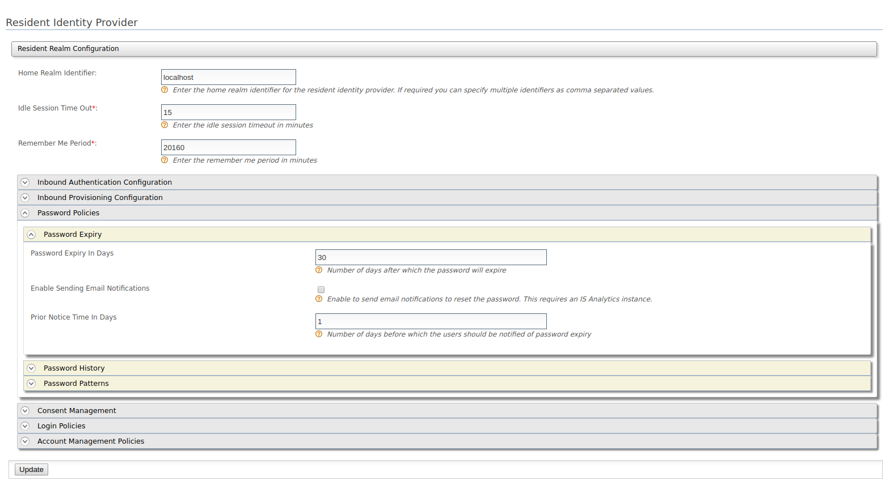
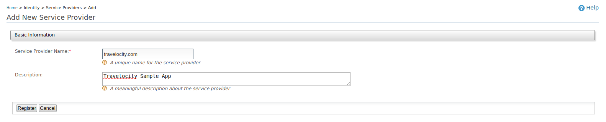
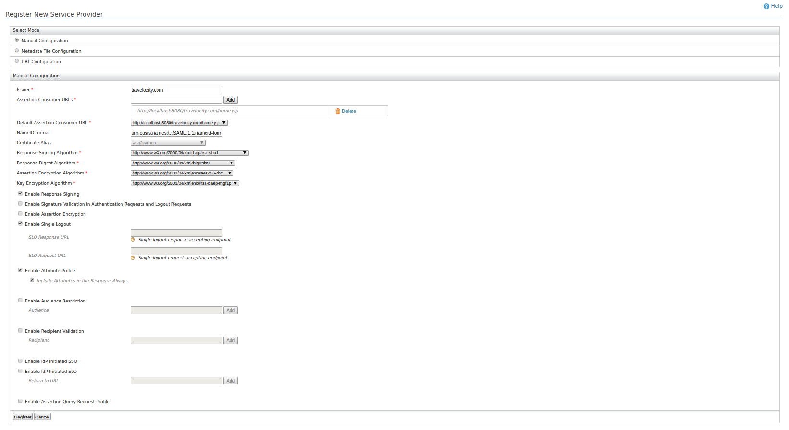
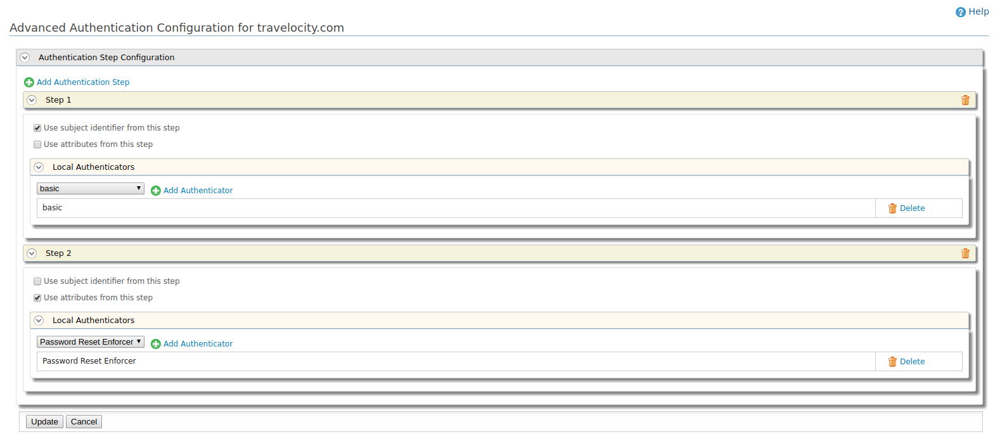
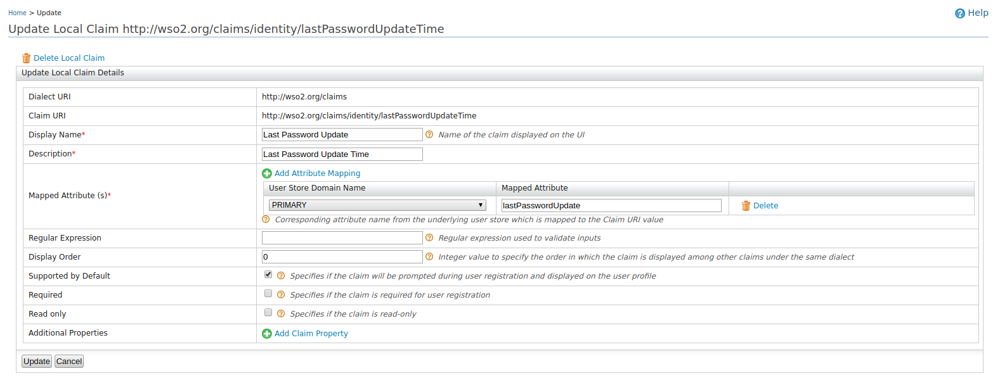
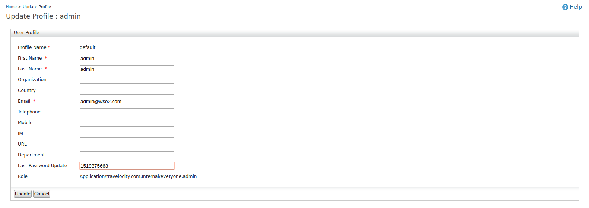

# Configuring Password Policy

* [Setting up Password Reset Enforcer](#setting-up-password-reset-enforcer)
* [Enabling the Password History Feature](#enabling-the-password-history-feature)
* [Enabling Email Notifications](#enabling-email-notifications)

## Setting up Password Reset Enforcer

### Deploying Artifacts

1. Download the Password Reset Enforcer and its artifacts from [WSO2 Store](https://store.wso2.com/store/assets/isconnector/details/502efeb1-cc59-4b62-a197-8c612797933c).

2. Download the latest wum updated IS pack from [here](https://wso2.com/identity-and-access-management/).

2. Add the following lines to `<IS_HOME>/repository/conf/deployment.toml` file

   ```
   [[event_handler]]
   name= "passwordExpiry"
   subscriptions =["POST_UPDATE_CREDENTIAL", "POST_UPDATE_CREDENTIAL_BY_ADMIN", "POST_ADD_USER"]
   [event_handler.properties]
   passwordExpiryInDays= "30"
   enableDataPublishing= false
   priorReminderTimeInDays= "0"
   ```
3. Copy the authentication page (`<PASSWORD_RESET_ENFORCER_ARTIFACTS>/is/pwd-reset.jsp`) to the `<IS_HOME>/repository/deployment/server/webapps/authenticationendpoint/` directory.
   
   > This directory is created after the first time you run Identity Server. If this is your first time, start the server once first.

4. Copy the connector (`org.wso2.carbon.extension.identity.authenticator.passwordpolicy.connector-<version>.jar`) to the `<IS_HOME>/repository/components/dropins/` directory.

> Please note that the Identity Server needs to be restarted after doing the above steps for the changes to take effect.

### Configuring the Expiration Policy

Follow the steps given below to configure the number of days after which the password should expire.

1. [Start](https://docs.wso2.com/display/IS540/Running+the+Product) the Identity Server and log in. (If you have not already done so)
2. In the `Identity` section under the `Main` tab, click `Resident` under `Identity Providers`.
3. Go to `Password Expiry` under `Password Policies`.
4. Change `Password Expiry In Days` according to your requirements.
   
   > By default, the Password Reset Enforcer will expire passwords in 30 days.
5. Click `Update` to save the changes.

> `Enable Sending Email Notifications` and `Prior Reminder Time In Days` configurations are used for configuring [email notifications](#enabling-email-notifications).



### Deploying the Sample App

This section explains how to use the Password Reset Enforcer using a sample app.
Deploy the sample web app [travelocity](https://docs.wso2.com/display/ISCONNECTORS/Deploying+the+Sample+App).
Once this is done the next step is to configure the service provider.

#### Configuring the Service Provider for the Sample App

1. [Start](https://docs.wso2.com/display/IS540/Running+the+Product) the Identity Server and log in. (If you have not already done so)
2. In the `Identity` section under the `Main` tab, click `Add` under `Service Providers`.
3. Enter `travelocity.com` in the `Service Provider Name` text box and click `Register`.
   
4. In the `Inbound Authentication Configuration` section, click `Configure` under the `SAML2 Web SSO Configuration` section.
5. Add the following line to the `/etc/hosts` file.
   ```
   127.0.0.1       wso2is.local
   ```
   > Some browsers do not allow you to create cookies for a naked hostname, such as localhost. Cookies are required when working with SSO. Therefore, to ensure that the SSO capabilities work as expected in this tutorial, you need to configure the etc/host file as explained in this step.
5. Configure the sample application (travelocity) as the service provider.
   * Issuer: `travelocity.com`
   * Assertion Consumer URL: `http://wso2is.local:8080/travelocity.com/home.jsp`
6. Enable the following options.
   * Response Signing
   * Single Logout
   * Attribute Profile
   * Include Attributes in the Response Always
   
   > The above options should be enabled or disabled according to your service provider. For travelocity, the relevant properties file (`travelocity.properties`) can be found inside the webapp `travelocy.com/WEB-INF/classes/`.
7. Click `Register` to save the changes. Now you will be sent back to the Service Providers page.
   


Follow the next few steps to add the password policy to the sample app

1. Go to `Local and Outbound Authentication Configuration` section in the Service Providers page.
2. Select the `Advanced Configuration` radio button option.
3. Add the `basic` authentication as the first step and `Password Reset Enforcer` authentication as the second step.
   * Select `User subject identifier from this step` under `basic` authentication.
   * Select `Use attributes from this step` under `Password Reset Enforcer`.
   
4. Click `Update` to save the changes.

#### Testing the Sample App

Follow the steps given below to test the Password Reset Enforcer.

> These steps should not be followed in a production environment. Therefore if you follow these steps make sure you change it back to the original state accordingly before moving to a production environment.

1. In the `Identity` section under the `Main` tab, click `List` under `Claims`.
2. Click `http://wso2.org/claims`.
3. Click `Edit` next to `Last Password Update` claim.
4. To test the sample, the password needs be expired manually. To edit the claim manually later, select `Supported by Default` checkbox.
5. Click `Update` to save the changes.
   
6. In the `Identity` section under the `Main` tab, click `List` under `Users and Roles` and then click `Users`.
7. Click `User Profile` next to the `admin` user (Or any preferred user).
8. Edit `Last Password Update` to a lower number (This is the last password change timestamp in milliseconds).
9. Click `Update` to save the changes.
   
10. Now try to log in to travelocity by going to `http://wso2is.local:8080/travelocity.com` and selecting a SAML SSO login option.
11. You will be requested to change the password.

## Enabling the Password History Feature

You can use the password history feature available on the Identity Server along with the password policy.
This will force the users to not use a previously used password again for a number of times into the future.
Please follow the instructions given in the [Password History Validation Policy](https://docs.wso2.com/display/IS540/Password+History+Validation) to enable this feature.

## Setting up Password Expiry Validation in Password Grant Flow

These steps can be followed to enable validating the user password expiry in password grant. This will pass an error message in response if the user password is expired.

1. Follow steps in [Setting up Password Reset Enforcer](#setting-up-password-reset-enforcer)
2. Add **PASSWORD_GRANT_POST_AUTHENTICATION** to subscriptions of *passwordExpiry* event handler in `<IS_HOME>/repository/conf/deployment.toml` file

 ```
   [[event_handler]]
   name= "passwordExpiry"
   subscriptions =["POST_UPDATE_CREDENTIAL", "POST_UPDATE_CREDENTIAL_BY_ADMIN", "POST_ADD_USER", "PASSWORD_GRANT_POST_AUTHENTICATION"]
   [event_handler.properties]
   passwordExpiryInDays= "30"
   enableDataPublishing= false
   priorReminderTimeInDays= "0"
   ```
3. Restart the WSO2 Identity Server

#### Try Example

1. Run following curl command with proper attribute values to the `client_id`, `client_secret`, `username`, `password`, `redirect_uri`

```
curl -v -X POST --basic -u <client_id>:<client_secret> -H 'Content-Type: application/x-www-form-urlencoded;charset=UTF-8' -k -d 'grant_type=password&username=<username>&password=<password>&redirect_uri=<redirect_uri>&scope=openid' https://<host>:<port>/oauth2/token
```
2. If user's password is expired then the response will be HTTP 400 error with following error message.

```
{"error_description":"Password has expired","error":"invalid_grant"}
```